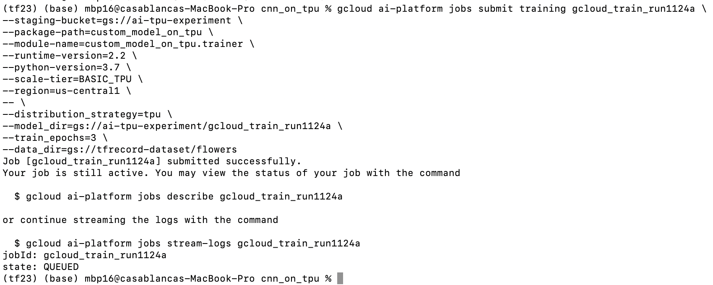
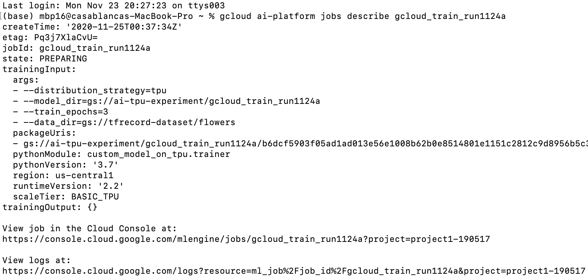
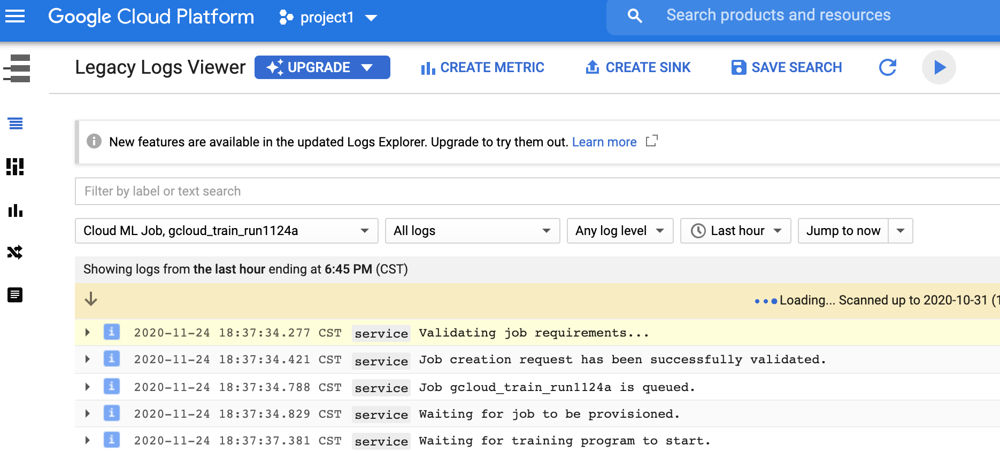
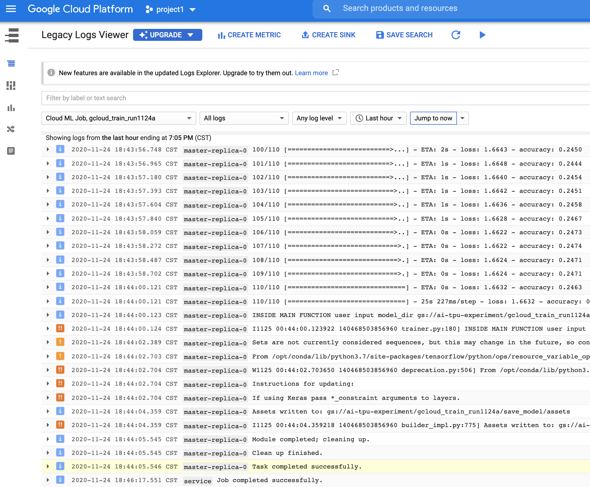

## Training a CNN model on TPU

To see how this example work, you need to complete the following first:

1. Go to [`tfrecord-dataset`](https://github.com/PacktPublishing/learn-tensorflow-enterprise/tree/master/chapter_05/tfrecord_dataset) and upload the content according to demonstration there. The folder contains the data for you to upload to your own Google cloud storage. 
2. Make a note of the file path, such as: `gs://<MY_BUCKET_NAME>/<DATA_DIR_NAME>` This is your `data_dir` in the command below.
In this path, you should have two training TFRecord parts, one validation part, one test part, and one small test part.
3. In GCP Storage portal create a target bucket (this is `model_dir` and `staging-bucket` in the training command example below) for staging purpose during training and saving the trained model one training is done. Make a note of the storage bucket name as `gs://<TRAIN_BUCKET_NAME>/<SAVING_FOLDER_NAME>`
4. Download ResNet feature vector to your local environm ent from TensorFlow Hub in https://tfhub.dev/google/imagenet/resnet_v2_50/feature_vector/4, unzip it, and then upload it to your own GCP storage bucket. Make a note of the path to the saved_model.pb. It should be something like: gs://<MY_BUCKET_AND_FOLDER>/imagenet_resnet_v2_50_feature_vector_4

Only then you may run the following command from this directory in your own environment:

```console
sh trainer_driver.sh
```

###You need to edit `trainer_driver.sh` by replacing these four inputs with that of your own: 

a job name,
`--staging-bucket`
`--model_dir`
`--data_dir`

In my case of example below, this is the command this shell script executes:

```console
gcloud ai-platform jobs submit training gcloud_train_run6 \
--staging-bucket=gs://ai-tpu-experiment \
--package-path=custom_model_on_tpu \
--module-name=custom_model_on_tpu.trainer \
--runtime-version=2.2 \
--python-version=3.7 \
--scale-tier=BASIC_TPU \
--region=us-central1 \
-- \
--distribution_strategy=tpu \
--model_dir=gs://ai-tpu-experiment/gcloud_train_run6 \
--train_epochs=3 \
--data_dir=gs://tfrecord-dataset/flowers
```

Job name is `gcloud_train_run6`  
Staging bucket is `gs://ai-tpu-experiment`  
Bucket to save the model is `gs://ai-tpu-experiment/gcloud_train_run6`   
Training data is in `gs://tfrecord-dataset/flowers`  

Notice `gcloud_train_run6` is the job name you assign to this execution. Each time you run this command, you need a new job name. GCP AI-Platform doesn't let you reuse job names.


Also, after `-- \`, what you see are script specific flags. If you write your own training script like I did in this case, these flag names are up to you. This is how you would specify user flags and pass these flags into your script.

Before `-- \` are all Google Cloud ai-platform flags. Therefore these flags names should not be changed.

## Expected outcome

You may submit the training job with `gcloud` command directly into your command line environment. Make sure you are in this directory. You will see output as below:



Notice it also gives us a command to retrieve running log:

`gcloud ai-platform jobs stream-logs gcloud_train_run1124a`

If you run the command, you will see:



The `View logs at:`gives you an URL. Once you navigate it via abrowser, you will see the running log:



It may take up to ten minutes for the training program to start. Google Cloud is looking for and prepare the resources. Your experience may vary depending on your region and resource availability.

Once the training ends, you will see output similar to this:



You may notice that with this simple model, validation accuracy is only around 20%. Later, when you use ResNet feature vector instead, your validation accuracy will reach above 80%. 

This means that with these flower images, it is actually very hard to custom build a model that works well. And when you leverage transfer learning with pre-trained ResNet feature vector, you will have much better validation accuracy.