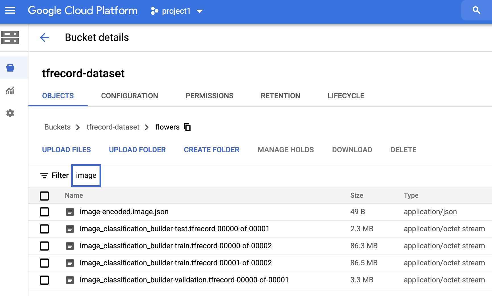

This folder contains the `TFRecord dataset`. You may upload the content to your cloud storage. 

You should upload `flower` directory into your cloud storage bucket. You may go to GCP portal to create a bucket and upload the directory.

Once you are done, below is an image of how it should look like:

